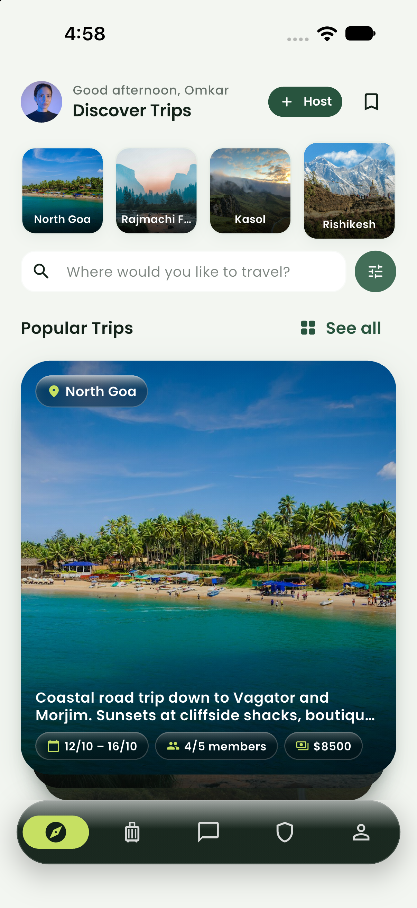

# TripMate (TripFam) 🌍🎒

> **Find your vibe before you fly.**  
> A premium, safety-first mobile application designed for solo travellers and small travel groups to discover shared departures, verify companions, and build trust before meeting on the road.

<p align="center">
  
</p>

---

## ✨ Highlights & Features

### 1. 🎴 Discover & Gesture Swipe Deck
- **Interactive Swipeable Deck:** Browse upcoming trips with smooth swipe gestures (swipe right to save, left to skip, tap to request).
- **Physical Cascading Peek:** Layered depth visualizer with dynamic card scaling and soft elevation shadows indicating stacked adventures behind the active card.
- **Upcoming Trips Strip:** Compact thumbnail carousel offering instant jump-to navigation for departures happening soon.
- **Instant Join Request Bottom Sheet:** Tapping any trip card slides up a modal form with one-tap icebreaker prompts, travel-vibe compatibility tags, and host review details.
- **Smart Filtering & Search:** Filter by destination, date windows, budget range, and verified-only departure requirements.

### 2. 🗺️ My Trips & Journey Pipeline
- **Dual Pipeline Navigation:** Fluid segmented switcher between **Departures** (trips you host) and **Requests** (join requests you've submitted).
- **5-Stage State Machine:** Live visual stepper tracking join progress:
  1. `Requested` ➜ 2. `Accepted` ➜ 3. `Intro Call Scheduled` ➜ 4. `Both Confirmed` ➜ 5. `Chat Unlocked`.
- **Intro Call Video Coordination:** Built-in scheduling card with HTTPS link validation supporting Google Meet, Zoom, and WhatsApp Video.

### 3. 💬 Trip Chats & Real-Time Messaging
- **Unlocked Group Hubs:** Group chats automatically unlock once travellers complete their introductory verification call.
- **Direct & Group Channels:** Trip-anchored chat rooms with unread badges, timestamp formatting, and member status indicators.

### 4. 🛡️ Safety Center & Traveler Protection
- **Status Dashboard:** Real-time safety state indicators (`Protected`, `Check-in Active`, `Departure Imminent`).
- **One-Tap Emergency Hotlines:** Direct dial triggers for National Emergency (112), Women's Helpline (1091), and Medical Response (102).
- **Trusted Contacts Hub:** Add, update, and manage designated emergency contacts with quick-action SMS and Phone dialer integrations.
- **Strict Privacy Projections:** Database policies and API projections strictly protect traveller home cities, emails, and phone numbers from public trip feeds.

### 5. 👤 Profile, Appearance & Data Sovereignty
- **Identity Verification Badges:** Selfie verification system with moderation review queue for verified-gated expeditions.
- **Personal Travel Preferences:** Curated style attributes (e.g., *Early Bird 6–8 AM*, *Balanced Pace*, *Road Trips*).
- **Theme Engine:** Custom glassmorphic dark and light themes with persistence via `SharedPreferences`.
- **GDPR Data Portability:** Built-in JSON export feature allowing travellers to download an encrypted snapshot of their account history.

---

## 🏗️ Architecture & Tech Stack

| Layer | Technology |
|---|---|
| **Framework** | [Flutter](https://flutter.dev) (Dart 3.x) |
| **State Management** | [Flutter Riverpod 2.x](https://riverpod.dev) (`StateNotifier`, `FutureProvider`, `family`) |
| **Routing** | [GoRouter](https://pub.dev/packages/go_router) with deep-linking & shell route navigation |
| **Backend & Auth** | [Supabase](https://supabase.com) (PostgreSQL, Row Level Security, Auth, Edge Functions) |
| **Design System** | Custom Tokens (`AppSpacing`, `AppRadius`, `AppTheme`), Glassmorphism (`GlassContainer`, `GlassIconButton`) |
| **Typography** | Poppins (Google Fonts, bundled under SIL Open Font License) |

---

## 🚀 Getting Started

### Prerequisites
- [Flutter SDK](https://docs.flutter.dev/get-started/install) (version `>=3.3.0`)
- Xcode (for iOS simulator/device) and/or Android Studio (for Android emulator/device)

### Installation

1. **Clone the repository:**
   ```sh
   git clone https://github.com/omkaranarse/tripfam.git
   cd tripfam
   ```

2. **Install dependencies:**
   ```sh
   flutter pub get
   ```

3. **Configure Environment Variables:**
   Copy the example environment file:
   ```sh
   cp .env.example .env.local
   ```
   Add your Supabase credentials:
   ```properties
   SUPABASE_URL=https://your-project.supabase.co
   SUPABASE_ANON_KEY=your-publishable-anon-key
   ```
   *(Note: Never place service role or secret keys in `.env.local`)*

4. **Launch the Application:**
   ```sh
   # Mobile (iOS or Android)
   flutter run --dart-define-from-file=.env.local

   # Web
   flutter run -d chrome --dart-define-from-file=.env.local
   ```

---

## 🎭 Live vs. Demo Mode

TripMate includes an authentic **Mumbai-first Travel Dataset** out of the box:
- By default, `DemoData.enabled = true` is active, allowing you to preview, swipe, request trips, simulate video calls, and explore full functionality without needing an active Supabase cloud instance.
- To connect to a live Supabase backend, toggle `DemoData.enabled = false` in [`lib/core/demo/demo_data.dart`](lib/core/demo/demo_data.dart) or via Riverpod's `demoModeProvider`.

---

## 🧪 Testing & Code Quality

TripMate maintains a 100% test pass rate with zero linting warnings across UI responsiveness, data projection security, state machines, and design system tokens.

```sh
# Run static analysis
flutter analyze

# Run all automated tests
flutter test
```

### Key Test Suites:
- `test/join_requests_and_intro_call_test.dart` — 5-stage state machine transitions, meeting link URL sanitization, and modal sheet tests.
- `test/swipeable_deck_widget_test.dart` — Card gesture thresholds, swipe physics, and cascading peek depth.
- `test/safety_features_test.dart` — Check-in logic, hotline actions, and emergency contact serialization.
- `test/phase4b_ui_polish_test.dart` — Cross-viewport layout checks (320px–1400px) and 1.5x accessibility text scale compliance.
- `test/design_system_components_test.dart` — Glassmorphism, segmented tabs, and design token coverage.

---

## 📄 License & Attribution

- **Fonts:** Poppins is licensed under the [SIL Open Font License](assets/fonts/OFL.txt).
- **Icons:** Material Icons by Google.
